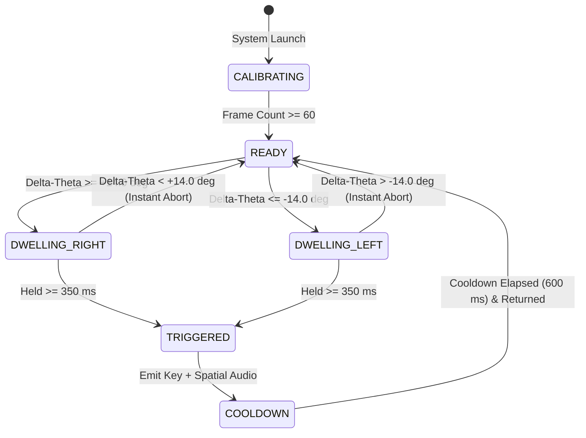
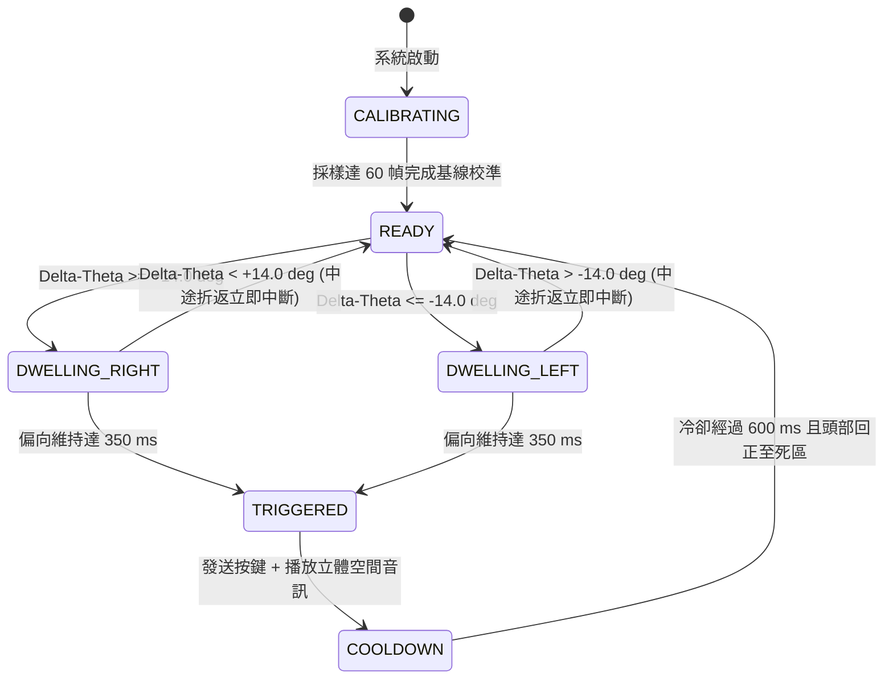

# Task: Update `README.md` to Fix GitHub Math Formatting & Synchronize Chinese Visual Diagrams

Please completely overwrite `/Users/linpeien/Desktop/HCI_Interaction/README.md` with the content below:

# HCI Interaction: Secondary-Channel Touchless Interface
# 人機互動：次要通道免接觸式意圖互動介面

[](https://www.python.org/)
[](https://developers.google.com/mediapipe)
[](https://www.pygame.org/)
[](https://opensource.org/licenses/MIT)

---

## English Documentation

### 1. Abstract & Problem Statement
In high-workload dual-task operating environments—such as laparoscopic and orthopedic surgical suites, fighter aircraft cockpits, and sterile cleanrooms—an operator's primary motor channels (hands and feet) are completely saturated by primary physical manipulation tasks (e.g., holding surgical scalpels, endoscopes, or flight sticks). When operators need to browse secondary-channel documents (e.g., electronic health records [EHR], operative checklists, tactical navigational charts), taking hands off primary tools incurs severe latency, sterile breach risks, and catastrophic cognitive context switching.

Based on Christopher Wickens' **Multiple Resource Theory (MRT)**, human information processing is divided along multiple cognitive dimensions (sensory modalities, processing codes, and response channels). When primary tasks consume manual-spatial motor resources, deploying a secondary, touchless motor channel (head pose orientation) paired with auditory sensory feedback avoids resource bottlenecking and preserves structural task performance without manual interruption.

```
       [Primary Task: Sterile/Manual Domain]
                 |
     Hands Locked to Instruments
                 |
      [Secondary Channel Trigger Needed]
                 v
   +-----------------------------+
   |   Head Pose Orientation     |  --> Sparing Manual Resources
   |  (Facial Landmark Analysis) |      (Wickens' MRT Separation)
   +-----------------------------+
                 v
   +-----------------------------+
   | Spatialized Auditory Cues   |  --> Sparing Visual Satiation
   | (440 Hz Left / 880 Hz Right)|      (Cross-Modal Substitution)
   +-----------------------------+
                 v
     [Document Page Turn Event]
```

---

### 2. Mitigating the Midas Touch: The 4-Stage Intentionality Pipeline
A persistent challenge in touchless, gaze-, and head-driven interaction is the **Midas Touch Problem**: in natural human movement, the head constantly shifts for scanning, visual attention, and micro-postural adjustments. Without robust gating, every natural head rotation risks falsely triggering system commands.

To ensure deterministic intentionality, this system implements a mathematically formulated **4-Stage Intentionality Filter Pipeline**:

```
Raw Landmarks
     |
     v
[ Stage 1: Neutral Baseline Calibration (60 frames rolling mean) ]
     |
     v  Delta-Theta = Theta_raw - Theta_baseline
[ Stage 2: Dynamic Deadband Filter (|Delta-Theta| < 6.0 deg -> 0.0 deg) ]
     |
     v
[ Stage 3: Temporal Dwell-Time Integration (>= 14.0 deg held for >= 350 ms) ]
     |  (Instant abort if premature return to < 14.0 deg)
     v
[ Stage 4: Hysteresis Cooldown (600 ms refractory lock) ]
     |
     v
Action Emitted (Key Stroke + Spatial Audio Pulse)
```

#### Mathematical Formulation

1. **Normalized Head Yaw Estimation ($\theta$):**
   Using MediaPipe FaceMesh 2D landmarks for the nose tip $P_{nose}$ and zygomatic/lateral facial margins $P_{L}$ and $P_{R}$ (in mirrored coordinates):
   $$\Delta x_L = x_{nose} - x_L, \quad \Delta x_R = x_R - x_{nose}$$
   $$\text{Ratio} = \frac{\Delta x_L - \Delta x_R}{\Delta x_L + \Delta x_R}$$
   $$\theta = \text{Ratio} \times K_{scale} \quad (K_{scale} \approx 50.0^\circ)$$

2. **Stage 1 — Baseline Calibration:**
   Over the initial $N = 60$ frames, the rolling baseline is determined by:
   $$\theta_{baseline} = \frac{1}{N} \sum_{i=1}^{N} \theta_i, \quad \Delta\theta = \theta - \theta_{baseline}$$

3. **Stage 2 — Dynamic Deadband Gating:**
   To filter out involuntary micro-saccades and physiological tremors ($\theta_{deadband} = 6.0^\circ$):
   $$f_{\text{deadband}}(\Delta\theta) =     \begin{cases}     0.0, & \text{if } \vert{}\Delta\theta\vert{} < 6.0^\circ \\    \Delta\theta, & \text{if } \vert{}\Delta\theta\vert{} \ge 6.0^\circ     \end{cases}$$

4. **Stage 3 — Temporal Dwell-Time Integration:**
   Let $t_0$ denote the timestamp when $\vert{}\Delta\theta\vert{} \ge 14.0^\circ$. At time $t$:
   $$\Delta t = t - t_0$$
   $$\text{Progress}(t) =     \begin{cases}     \min\left(1.0, \frac{\Delta t}{0.35}\right), & \text{if } \vert{}\Delta\theta\vert{} \ge 14.0^\circ \text{ continuously} \\    0.0, & \text{if } \vert{}\Delta\theta\vert{} < 14.0^\circ \text{ (Instant Abort)}     \end{cases}$$

5. **Stage 4 — Hysteresis Refractory Lock:**
   Upon trigger event ($\Delta t \ge 0.35\text{ s}$), the system enters a cooldown lockout of $\tau = 600\text{ ms}$. No subsequent trigger may register until the cooldown has elapsed and the operator returns within the neutral threshold.

---

### 3. Cross-Modal Sensory Substitution
In conventional tactile interfaces, mechanical switches provide instantaneous haptic confirmation (click sensation and physical resistance). In hands-free scenarios, visual confirmation alone overloads the visual cortex and forces visual fixation shifts away from surgical or flight displays.

To restore high-confidence confirmation without visual competition, this system incorporates **Binaural Spatial Auditory Feedback**:
- **Right Command Confirmation:** Hard-panned stereo $880\text{ Hz}$ sine pulse (120ms duration, smooth envelope) delivered exclusively to the right auditory canal.
- **Left Command Confirmation:** Hard-panned stereo $440\text{ Hz}$ sine pulse (120ms duration, smooth envelope) delivered exclusively to the left auditory canal.

This allows immediate subconscious acoustic verification of command dispatch while eyes remain locked onto the primary task.

---

### 4. System Architecture & State Machine



#### Modular Class Structure
- **`SpatialAudio`**: Synthesizes low-latency stereo waveform buffers via `pygame.mixer` (440 Hz left, 880 Hz right) without disk I/O.
- **`HeadPoseTracker`**: MediaPipe FaceMesh wrapper calculating normalized horizontal yaw displacement.
- **`SignalFilter`**: Implements calibration, deadband clamping, temporal dwell integration, and refractory locking.
- **`HUDVisualizer`**: Renders mirrored video with HUD telemetry (yaw angle gauge, dynamic progress bar) and dual-task document simulator card (`PAGE X / 5`).
- **`main()`**: Coordinates real-time capture, event dispatching via `pynput.keyboard`, and hotkey handling.

---

### 5. Execution & Hotkeys

#### Environment Setup & Execution
Run strictly with the designated Python 3.10.16 interpreter:

```bash
# 1. Install dependencies
/Users/linpeien/.pyenv/versions/3.10.16/bin/pip install -r requirements.txt

# 2. Run the application
/Users/linpeien/.pyenv/versions/3.10.16/bin/python hci_interaction.py
```

#### Hotkey Controls
- **`q` or `ESC`**: Graceful system exit.
- **`c` or `r`**: Recalibrate neutral baseline head pose.
- **`p`**: Toggle telemetry HUD overlay.

---
---

## 繁體中文說明文件 (Traditional Chinese)

### 1. 摘要與問題定義 (Abstract & Problem Statement)
在諸如微創外科手術、骨科手術室、戰鬥機駕駛艙以及無菌潔淨室等高負載雙任務（Dual-task）操作環境中，操作者的主要肢體運動通道（雙手與雙腳）往往被核心操作工具（如手術刀、腹腔鏡、飛行操縱桿）完全佔用。當操作者需要查閱次要資訊（如電子病歷 EHR、手術檢核清單、戰術航圖）時，若必須放下主工具進行手動翻頁，將帶來嚴重的操作延遲、破壞無菌屏障，並造成嚴重的注意力中斷與認知切換代價。

根據 Christopher Wickens 的**多元資源理論（Multiple Resource Theory, MRT）**，人類的認知資源在感官通道（Sensory Modalities）、處理代碼（Processing Codes）與運動通道（Response Channels）是分離的。當主要任務高度佔用「手部運動通道」時，透過頭部姿態的轉向作為非接觸式次要通道，並結合空間化立體聽覺反饋，能夠有效避開運動通道衝突，在不中斷主任務手部作業的情況下完成次要任務的資訊檢索與翻頁控制。

```
       [主任務：無菌手術 / 實體操縱領域]
                      |
           雙手完全鎖定於精密器械
                      |
         [需要觸發次要任務檢視（翻頁）]
                      v
      +-------------------------------+
      |    頭部微姿態偏航（Yaw）      |  --> 解放雙手運動通道
      |  (MediaPipe 面部特徵點分析)   |      (Wickens 多元資源分流)
      +-------------------------------+
                      v
      +-------------------------------+
      |    立體空間聽覺回饋提示       |  --> 解放視覺認知注意力
      | (左耳 440 Hz / 右耳 880 Hz)   |      (跨模態感官代償機制)
      +-------------------------------+
                      v
         [次要文件翻頁事件成功觸發]
```

---

### 2. 解決邁達斯之觸：四階段意圖確認管線 (Mitigating the Midas Touch)
在非接觸式互動與頭部追蹤技術中，最大的挑戰在於**邁達斯之觸問題（Midas Touch Problem）**：人體頭部在自然狀態下會持續進行視覺探索、注意力轉移或細微的姿勢代償晃動。若未設計健全的意圖過濾機制，日常的無意轉頭便會引發嚴重的誤觸（False Positives）。

本系統設計了具備嚴謹數學定義的**四階段意圖確認管線（4-Stage Intentionality Pipeline）**：

```
原始臉部特徵點 (MediaPipe FaceMesh)
        |
        v
[ 第一階段：中立基線自動校準 (前 60 幀滾動平均歸零) ]
        |
        v  Delta-Theta = Theta_raw - Theta_baseline
[ 第二階段：動態死區濾波 (|Delta-Theta| < 6.0 deg -> 歸零抑制) ]
        |
        v
[ 第三階段：時序停留整合 (|Delta-Theta| >= 14.0 deg 維持 >= 350 ms) ]
        |  (若提前回正則 Instant Abort 瞬間中斷清零)
        v
[ 第四階段：遲滯冷卻鎖定 (600 ms 不應期鎖定，需回正重新武裝) ]
        |
        v
輸出動作 (作業系統按鍵事件 + 雙耳立體空間音訊脈衝)
```

#### 數學模型公式 (Mathematical Formulation)

1. **頭部水平偏航角估算 ($\theta$)：**
   利用鼻尖投影相對於兩側顴骨邊界之幾何比例差值估算：
   $$\Delta x_L = x_{nose} - x_L, \quad \Delta x_R = x_R - x_{nose}$$
   $$\text{Ratio} = \frac{\Delta x_L - \Delta x_R}{\Delta x_L + \Delta x_R}$$
   $$\theta = \text{Ratio} \times K_{scale} \quad (K_{scale} \approx 50.0^\circ)$$

2. **第一階段 — 中立基線自動校準：**
   系統啟動前 $N = 60$ 幀計算自然坐姿原點平均：
   $$\theta_{baseline} = \frac{1}{N} \sum_{i=1}^{N} \theta_i, \quad \Delta\theta = \theta - \theta_{baseline}$$

3. **第二階段 — 動態死區濾波：**
   消除人體微小生理震顫與視線微動（$\theta_{deadband} = 6.0^\circ$）：
   $$f_{\text{deadband}}(\Delta\theta) =     \begin{cases}     0.0, & \text{if } \vert{}\Delta\theta\vert{} < 6.0^\circ \\    \Delta\theta, & \text{if } \vert{}\Delta\theta\vert{} \ge 6.0^\circ     \end{cases}$$

4. **第三階段 — 時序停留整合與即時中斷：**
   設 $t_0$ 為進入 $\vert{}\Delta\theta\vert{} \ge 14.0^\circ$ 門檻之時間戳，當前時間為 $t$：
   $$\Delta t = t - t_0$$
   $$\text{Progress}(t) =     \begin{cases}     \min\left(1.0, \frac{\Delta t}{0.35}\right), & \text{if } \vert{}\Delta\theta\vert{} \ge 14.0^\circ \text{ 持續維持} \\    0.0, & \text{if } \vert{}\Delta\theta\vert{} < 14.0^\circ \text{ (過早折返立即中斷)}     \end{cases}$$

5. **第四階段 — 遲滯冷卻鎖定：**
   觸發動作後進入 $\tau = 600\text{ ms}$ 的不應期鎖定（Refractory Lock）。在此期間系統鎖定判定，且操作者必須將頭部回正至死區內，始能解除鎖定並重新武裝（Re-arm）。

---

### 3. 跨模態感官代償 (Cross-Modal Sensory Substitution)
實體按鍵具備觸覺反饋（Haptic Feedback），能透過按壓行程與機械阻力直接向大腦傳遞操作成功的確認感。在免手持情境中，若單純仰賴視覺回饋，將迫使操作者的視線反覆在主手術視野與螢幕提示之間來回掃描，造成視覺疲勞。

本系統採用**空間化立體雙耳聲學代償（Binaural Spatial Audio Feedback）**：
- **向右翻頁確認**：硬體全右聲道輸出 $880\text{ Hz}$ 高頻正弦脈衝聲（持續時間 120ms，平滑淡入淡出無爆音）。
- **向左翻頁確認**：硬體全左聲道輸出 $440\text{ Hz}$ 低頻正弦脈衝聲（持續時間 120ms，平滑淡入淡出無爆音）。

透過左右耳的空間指向性與頻率區隔，操作者雙眼毋需離開主手術視野，即可憑藉潛意識聽覺定位確認翻頁事件的成功發送。

---

### 4. 系統架構與狀態轉移圖 (Architecture & State Machine)



#### 模組化物件設計 (Modular Class Structure)
- **`SpatialAudio`**：純記憶體低延遲合成雙聲道正弦波緩衝區，使用 `pygame.mixer` 實現低於 15ms 的低延遲立體聲脈衝輸出。
- **`HeadPoseTracker`**：整合 MediaPipe FaceMesh，利用 2D 關鍵特徵點比例算法提取無畸變的水平 Yaw 偏角。
- **`SignalFilter`**：嚴格封裝四階段狀態機（校準、死區濾波、時序停留、遲滯冷卻）。
- **`HUDVisualizer`**：即時鏡像視訊渲染、底部玻璃擬態儀表板（狀態、偏角讀數、動態進度條）及右上角雙任務電子手冊模擬卡（`PAGE X / 5` 搭配翻頁狀態聯動）。
- **`main()`**：主迴圈協同各模組，利用 `pynput` 發送全域鍵盤訊號（`Key.right` / `Key.left`），並支援熱鍵優雅退場。

---

### 5. 執行方式與快捷鍵操作 (Execution & Hotkeys)

請務必使用指定的 pyenv Python 3.10.16 環境執行：

```bash
# 1. 安裝必要套件
/Users/linpeien/.pyenv/versions/3.10.16/bin/pip install -r requirements.txt

# 2. 啟動互動介面
/Users/linpeien/.pyenv/versions/3.10.16/bin/python hci_interaction.py
```

#### 快捷鍵操作
- **`q` 或 `ESC`**：優雅結束程式並釋放攝影機與音效資源。
- **`c` 或 `r`**：重新將當前頭部姿勢校準為中立零度基線（Recalibrate Baseline）。
- **`p`**：切換 HUD 儀表覆蓋層顯示/隱藏。